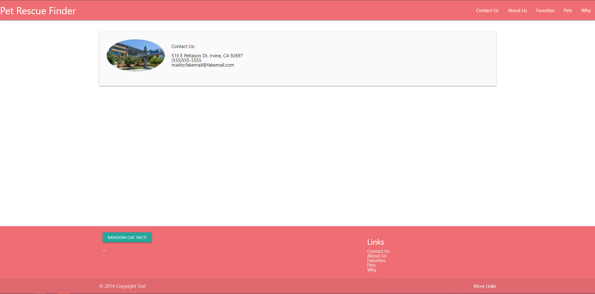
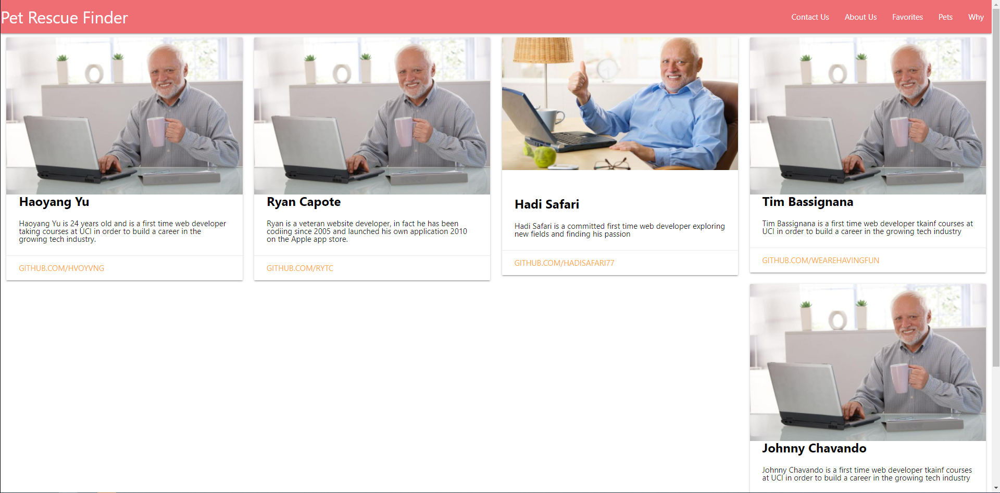
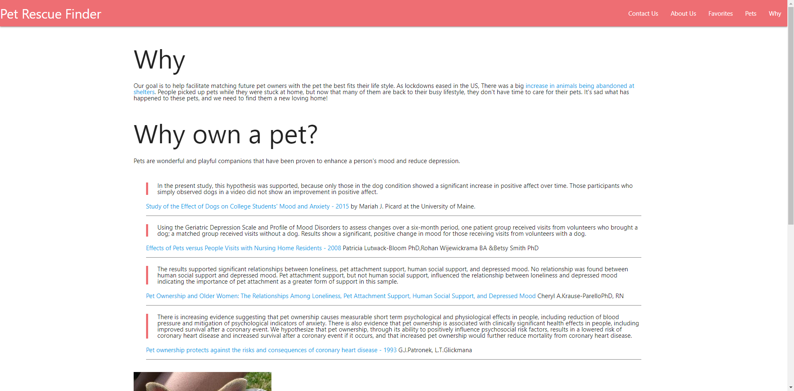
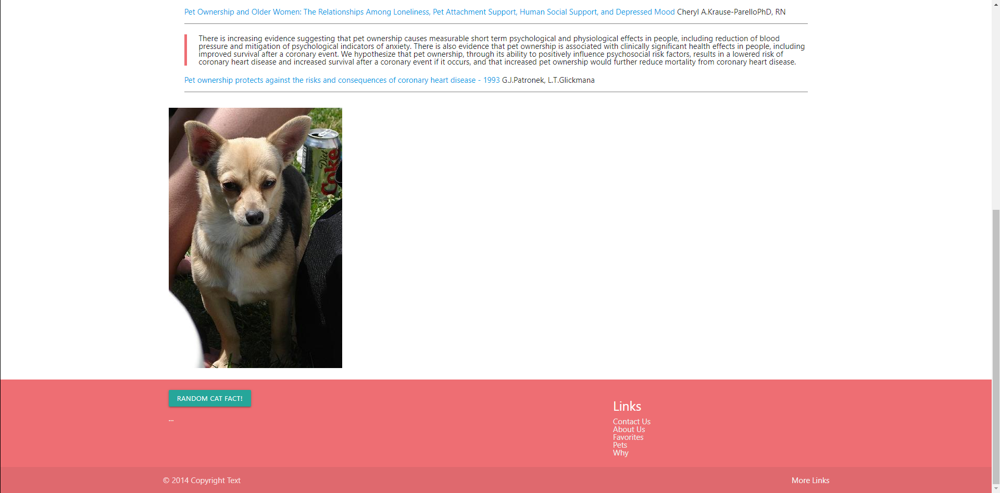

# Group-Project-Dogs
Pet Rescue Finder is an app that is used to find a adoptable pet in your desired city and return a list of pets around the city you have given.

# Motivation
Due to COVID-19 many people chose to adopt animals during the quarantine to keep them company when they were working at home. As COVID restrictions continue to be lifted across the country, people started going back to work and they have no time and no one to take care of their pets. Their only choice as responsible pet owners is to give them up to a shelter. Recently animal shelters have been overfilled with animals that have been given up since the lifted restrictions. We hope with our application we are able to help people who are looking to adopt an animal to lower the number of animals that are in shelters and find a better home for them.

# Description
We have created an app that will take in user input such as the city and the type of animal they would like to adopt and return a list of adoptable pets in the surrounding areas.

We used a random dog image API to generate a random image of a dog on the front page whenever the user enter the website or when the user refreshes the webpage.
> https://dog.ceo/dog-api/

We also have a random cat facts API in the footer of the website to generate a random cat fact whenever the user clicks the Get Fact button. This does not generate upon refresh and only generates the cat fact with the user input.
> https://catfact.ninja/fact

We used the petfinder API which allows us to access the Petfinder database of hundreds of thousands of pets ready for adoption and over ten thousand animal welfare organizations.
> https://api.petfinder.com/v2/oauth2/token

[See live site here](https://hadisafari77.github.io/Group-Project-Dogs/)

# How to Use Pet Rescue Finder 
The user will enter in their desired city and check the boxes of their desired pets such as dogs, cats, birds, and etc.
The website will return to the user a list of the the adoptable pets in the surrounding area of the city the user chose.
The list will include a multiple cards with one animal on each card.
The card wil include the name and age of the pet, as well as some descriptions of the pet.
The user is able to save the adoptable pets to the local storage for later.

# Tech and Framework Used
> HTML
> CSS
> MaterializedCSS
> Javascript

# APIs Used
> https://catfact.ninja/fact
> https://dog.ceo/dog-api/

## Team
- Ryan ([Github](https://github.com/rytc))
- Hadi ([Github](https://github.com/hadisafari77)
- Tim ([Github](https://github.com/wearehavingfun))
- Johnny ([Github](https://github.com/Shavv97))
- Haoyang ([Github](https://github.com/hvoyvng))

# Screenshots
![Screenshot] 

